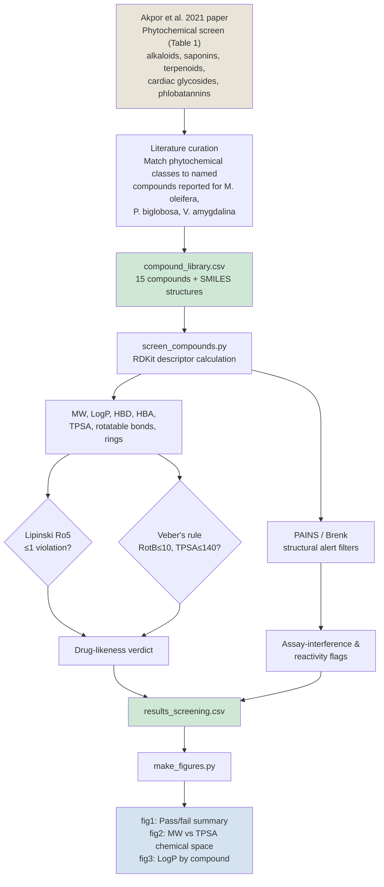

# Drug-Likeness & Cheminformatics Screening of Plant-Derived Antimicrobial Compounds

RDKit-based screening of phytochemicals reported in three medicinal plants — **Moringa oleifera**, **Parkia biglobosa**, and **Vernonia amygdalina** — for drug-likeness (Lipinski's Rule of Five, Veber's rule) and structural toxicity/reactivity alerts (PAINS, Brenk).

This project is a computational companion analysis to:

> Akpor, O.B., Ndakotsu, J., Evbuomwan, I.O., Olaolu, T.D., Osemwegie, O.O. (2021). *Bacterial growth inhibition and antioxidant potentials of leaf infusions of (Moringa oleifera), locust beans (Parkia biglobosa) and bitter leaf (Vernonia amygdalina)*. Scientific African, 14, e01001.

The original study identified antibacterial and antioxidant activity in aqueous leaf infusions and characterized the phytochemical classes present (alkaloids, saponins, terpenoids, cardiac glycosides, phlobatannins) via standard qualitative assays, but did not evaluate individual compound structures. This project extends that work by mapping those phytochemical classes onto specific, literature-reported compounds and screening them computationally for drug-likeness.

## Pipeline



## Files

| File | Description |
|---|---|
| `compound_library.csv` | 15 curated compounds (name, source plant, phytochemical class, SMILES) |
| `screen_compounds.py` | RDKit script: computes descriptors, Lipinski/Veber verdicts, PAINS/Brenk alerts |
| `results_screening.csv` | Output of the screen — one row per compound |
| `make_figures.py` | Generates the three summary figures from the results CSV |
| `fig1_druglikeness_summary.png` | Pass/fail bar chart |
| `fig2_lipinski_space.png` | MW vs TPSA scatter, annotated with Ro5/Veber threshold lines |
| `fig3_logp_by_compound.png` | LogP ranked bar chart across the library |

## How to run

```bash
pip install rdkit pandas matplotlib
python3 screen_compounds.py compound_library.csv results_screening.csv
python3 make_figures.py results_screening.csv
```

## Results summary

**13 of 15 compounds (86.7%)** passed both Lipinski's Rule of Five (≤1 violation) and Veber's rule, indicating favorable predicted oral drug-likeness across the phytochemical classes identified in the source plants.

The two exceptions:
- **Rutin** — MW 610.5, TPSA 269.4 Ų, 3 Ro5 violations. The glycoside form is too large/polar for passive membrane permeability; its aglycone (quercetin) is the more bioavailable form after metabolic hydrolysis.
- **Chlorogenic acid** — passes Ro5 (1 violation) but fails Veber's rule (TPSA 164.8 Ų > 140).

Structural alerts flagged a **catechol** substructure (PAINS — assay interference, e.g. redox cycling/metal chelation, not a toxicity verdict) in 7 compounds, and a **Michael acceptor** motif (Brenk — genuine reactive electrophile) in ferulic, caffeic, and chlorogenic acids — plausibly linked to their radical-scavenging activity rather than purely a liability.

## Limitations

This is a preliminary computational triage, not a substitute for experimental toxicity or pharmacokinetic testing:

1. The compound library represents literature-reported phytochemicals for these species, not a complete metabolomic profile of the specific leaf infusions used in the parent study.
2. PAINS/Brenk alerts flag structural liabilities associated with assay interference or reactivity — not confirmed toxicity. Several flagged compounds (e.g. catechol-containing phenolics) are well-established dietary antioxidants with extensive safety data.
3. Lipinski's Rule of Five is a heuristic for oral absorption/permeability, not a measure of antimicrobial potency, selectivity, or systemic toxicity.
4. RDKit does not perform predictive toxicology. Confirmatory in-silico toxicity assessment (e.g. mutagenicity, hepatotoxicity) would require dedicated tools such as ProTox-3.0 or admetSAR.

## License / attribution

Compound structures compiled from publicly available phytochemistry literature. Original antibacterial/antioxidant study cited above is © 2021 The Authors, published by Elsevier under CC BY-NC-ND 4.0.
